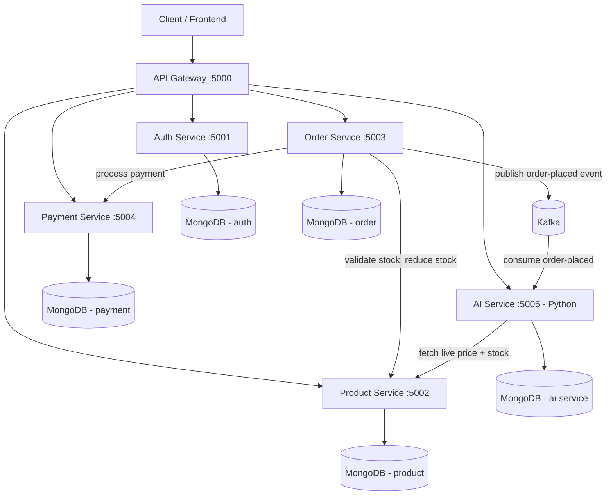

# Ecommerce Backend — Microservices Architecture

A backend for an ecommerce platform built as independent, containerized microservices instead of a single monolith. Each service owns its own database, communicates over REST for synchronous needs, and publishes events over **Kafka** for everything that doesn't need an immediate answer — feeding a Python AI service that handles recommendations, demand forecasting, and dynamic pricing.

## Architecture



## Services

| Service | Responsibility | Port |
|---|---|---|
| **API Gateway** | Single entry point, routes to services | 5000 |
| **Auth Service** | Register/login, JWT issuing, bcrypt | 5001 |
| **Product Service** | Catalog, categories, inventory | 5002 |
| **Order Service** | Cart, orders, order status, publishes Kafka events | 5003 |
| **Payment Service** | Mock payment processing, payment status | 5004 |
| **AI Service** (Python) | Recommendations, demand forecasting, dynamic pricing | 5005 |

Each service gets its **own MongoDB database** (true microservice isolation), its own Dockerfile, and talks to others via REST — plus one asynchronous path via Kafka. Everything orchestrated with `docker-compose up`.

## Why microservices here

- **Database-per-service** — each service owns its data; no shared schema, no service can be broken by another team's migration.
- **API Gateway pattern** — the client talks to one host (`:5000`); it doesn't know or care how many services sit behind it.
- **Synchronous service-to-service communication** — placing an order calls the Product Service to validate/reduce stock, then the Payment Service to process payment. The AI Service also calls Product Service synchronously when computing a price suggestion, since it needs the *current* stock level, not a stale copy.
- **Asynchronous event-driven communication (Kafka)** — once an order is placed, an `order-placed` event is published to Kafka. The Order Service doesn't know or care who's listening — right now it's the AI Service building recommendation and demand data, but the same event could feed analytics or notifications later without ever touching Order Service code again.
- **Polyglot microservices** — the AI Service is Python while everything else is Node.js, showing the services communicate over language-agnostic protocols (REST + Kafka), not shared code.
- **Independent deployability** — each service has its own `Dockerfile`, and can be built/deployed/scaled on its own.

## The AI Service — Three Features, One Data Source

All three features are built from the same `order-placed` Kafka stream — no external dataset needed, everything is learned from the platform's own order history.

### 1. Recommendations — "customers also bought"
Item-based collaborative filtering: every order increments a co-purchase count for each pair of products bought together. `GET /api/recommendations/:productId` returns the top N products most frequently bought alongside it, ranked by count.

### 2. Demand Forecasting
Each order also updates a per-product daily sales time series. `GET /api/forecast/:productId` computes a **weighted moving average** (recent days count more) over the last 14 days, plus a trend adjustment (rising/falling/stable based on comparing the recent half of the window to the older half), and projects expected demand for the next 7 days.

This is a deliberately explainable calculation rather than a black-box model — in an interview, you can walk through exactly how a forecast number was produced, which matters more than naming a fancier library.

### 3. Dynamic Pricing
`GET /api/pricing/:productId` combines the demand forecast with the product's **live stock level** (fetched from Product Service) to suggest a price adjustment:
- Less than ~3 days of stock left at the forecasted sell-through rate → price increases (scarcity)
- More than ~21 days of stock at current demand → price decreases (move slow inventory)
- Otherwise → price holds steady

Adjustments are capped at ±20% of the base price — an intentional guardrail so the algorithm can never suggest something extreme, which is exactly the kind of safety constraint a real pricing system needs.

## Getting Started

### Option 1: Docker Compose (recommended — spins up all 6 services + Kafka + 5 databases)

```bash
git clone https://github.com/<your-username>/ecommerce-microservices.git
cd ecommerce-microservices
docker-compose up --build
```

The whole system is live at `http://localhost:5000`. Kafka takes a few seconds to become ready on first boot — Order Service will log a connection retry if it starts before Kafka is up, which is expected and resolves automatically.

### Option 2: Run services individually (for development)

Each Node service (`auth-service`, `product-service`, `order-service`, `payment-service`, `api-gateway`):
```bash
cd <service-folder>
cp .env.example .env
npm install
npm run dev
```

For `ai-service` (Python):
```bash
cd ai-service
cp .env.example .env
pip install -r requirements.txt
python app.py
```

You'll need local MongoDB and Kafka instances running, or point the `.env` files at hosted equivalents.

## API Overview (via API Gateway, `http://localhost:5000`)

**Auth**
```
POST /api/auth/register     { name, email, password }
POST /api/auth/login        { email, password }
```

**Products**
```
GET    /api/products               list all (supports ?category=&search=)
GET    /api/products/:id           get one
POST   /api/products               create (admin, requires JWT)
PUT    /api/products/:id           update (admin)
DELETE /api/products/:id           delete (admin)
```

**Orders**
```
POST /api/orders                   place an order (requires JWT) — publishes order-placed to Kafka on success
GET  /api/orders/my-orders         your order history (requires JWT)
GET  /api/orders/:id               get one order
```

**Payments**
```
GET /api/payments/order/:orderId   check payment status for an order
```

**AI Service**
```
GET /api/recommendations/:productId?limit=5    "customers also bought"
GET /api/forecast/:productId                   demand forecast for next 7 days
GET /api/pricing/:productId                    suggested dynamic price based on demand + stock
```

All protected routes expect `Authorization: Bearer <token>` from `/api/auth/login`.

## Order Flow (the interesting part)

1. Client calls `POST /api/orders` with cart items → hits Order Service via the Gateway
2. Order Service calls Product Service to check + reduce stock for each item (synchronous — must succeed before continuing)
3. Order Service calls Payment Service to process payment (synchronous)
4. Order status updates to `paid` or stays `pending` based on payment result
5. Order Service publishes an `order-placed` event to Kafka (asynchronous — doesn't block the response)
6. Client gets back the final order immediately, without waiting on step 5
7. In the background, AI Service consumes the event, updating co-purchase data and the daily sales time series that recommendations, forecasting, and pricing all read from

## Possible Extensions

- Redis caching in Product Service for hot product lookups
- CI/CD pipeline (GitHub Actions) to build and push each service's image
- Kubernetes manifests for orchestration instead of docker-compose
- A second Kafka consumer group for analytics/reporting, showing multiple independent consumers on the same topic
- Fraud detection as another Kafka consumer on the same `order-placed` topic
- Swapping the forecasting model for a proper time-series library (e.g. Prophet) once there's enough real order volume to justify it

## License

MIT