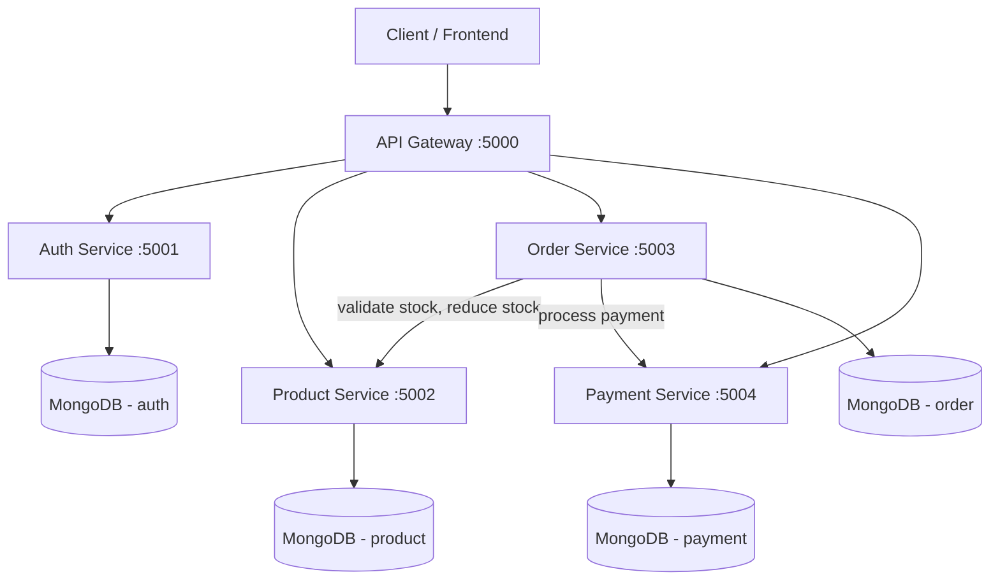

# Ecommerce Backend — Microservices Architecture

A backend for an ecommerce platform built as independent, containerized microservices instead of a single monolith. Each service owns its own database, communicates over REST, and sits behind a single API Gateway.

## Architecture



## Why microservices here

- **Database-per-service** — each service owns its data; no shared schema, no service can be broken by another team's migration.
- **API Gateway pattern** — the client talks to one host (`:5000`); it doesn't know or care how many services sit behind it.
- **Service-to-service communication** — placing an order actually calls the Product Service to validate/reduce stock, then the Payment Service to process payment, demonstrating real inter-service orchestration (not just isolated CRUD apps).
- **Independent deployability** — each service has its own `Dockerfile`, `package.json`, and can be built/deployed/scaled on its own.

## Services

| Service | Port | Responsibility |
|---|---|---|
| `api-gateway` | 5000 | Routes incoming requests to the correct backend service |
| `auth-service` | 5001 | Registration, login, JWT issuing (bcrypt-hashed passwords) |
| `product-service` | 5002 | Product catalog, categories, stock management |
| `order-service` | 5003 | Cart/order creation, validates stock, triggers payment |
| `payment-service` | 5004 | Simulated payment processing |

## Tech Stack

Node.js · Express · MongoDB (Mongoose) · JWT · Docker & Docker Compose · Axios (inter-service calls)

## Getting Started

### Option 1: Docker Compose (recommended — spins up all 5 services + 4 databases)

```bash
git clone https://github.com/<your-username>/ecommerce-microservices.git
cd ecommerce-microservices
docker-compose up --build
```

That's it — the whole system is live at `http://localhost:5000`.

### Option 2: Run services individually (for development)

Each service is a standalone Node app:

```bash
cd auth-service
cp .env.example .env   # fill in JWT_SECRET, Mongo URI
npm install
npm run dev
```

Repeat for `product-service`, `order-service`, `payment-service`, `api-gateway`. You'll need a local MongoDB instance running for each, or point `MONGO_URI` at MongoDB Atlas.

## API Overview (via API Gateway, `http://localhost:5000`)

**Auth**
```
POST /api/auth/register     { name, email, password }
POST /api/auth/login        { email, password }
```

**Products**
```
GET    /api/products               list all (supports ?category=&search=)
GET    /api/products/:id           get one
POST   /api/products               create (admin, requires JWT)
PUT    /api/products/:id           update (admin)
DELETE /api/products/:id           delete (admin)
```

**Orders**
```
POST /api/orders                   place an order (requires JWT)
GET  /api/orders/my-orders         your order history (requires JWT)
GET  /api/orders/:id               get one order
```

**Payments**
```
GET /api/payments/order/:orderId   check payment status for an order
```

All protected routes expect `Authorization: Bearer <token>` from `/api/auth/login`.

## Order Flow (the interesting part)

1. Client calls `POST /api/orders` with cart items → hits Order Service via the Gateway
2. Order Service calls Product Service to check + reduce stock for each item
3. Order Service calls Payment Service to process payment
4. Order status updates to `paid` or stays `pending` based on payment result
5. Client gets back the final order with status

## Possible Extensions

- Message queue (RabbitMQ/Kafka) between services instead of direct REST calls
- Redis caching in Product Service
- CI/CD pipeline (GitHub Actions) to build and push each service's image
- Kubernetes manifests for orchestration instead of docker-compose

## License

MIT
